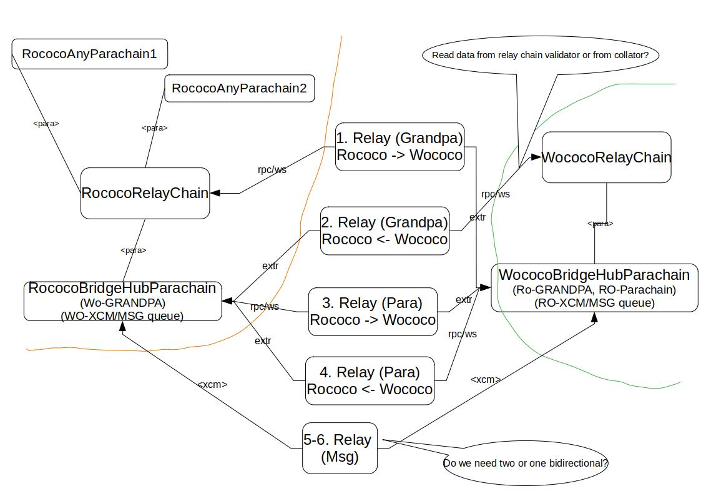

- [Bridge-hub Parachains](#bridge-hub-parachains)
	* [How to test locally Rococo <-> Wococo](#how-to-test-locally-rococo-----wococo)
		+ [Prepare/Build/Deploy](#prepare-build-deploy)
		+ [Run chains (Rococo + BridgeHub, Wococo + BridgeHub) with zombienet](#run-chains--rococo---bridgehub--wococo---bridgehub--with-zombienet)
		+ [Run relayers (Rococo, Wococo)](#run-relayers--rococo--wococo-)
			- [Run with script (alternative 1)](#run-with-script--alternative-1-)
			- [Run with binary (alternative 2)](#run-with-binary--alternative-2-)
		+ [Send messages (Rococo, Wococo)](#send-messages--rococo--wococo-)
			- [Local Rococo:Statemine -> Wococo:Westmint](#local-rococo-statemine----wococo-westmint)
			- [Live Rococo:Rockmine2 -> Wococo:Wockmint](#live-rococo-rockmine2----wococo-wockmint)
	* [How to test local BridgeHubKusama](#how-to-test-local-bridgehubkusama)
	* [Git subtree `./bridges`](#git-subtree---bridges-)

# Bridge-hub Parachains

Implementation of _BridgeHub_, a blockchain to support message passing between Substrate based chains like Polkadot and Kusama networks.

_BridgeHub_ allows users to:

- Passing arbitrary messages between different Substrate chains (Polkadot <-> Kusama).

_BridgeHub_ is meant to be **_system parachain_** with main responsibilities:
- sync finality proofs between relay chains
- sync finality proofs between BridgeHub parachains
- pass (XCM) messages between different BridgeHub parachains



## How to test locally Rococo <-> Wococo

### Prepare/Build/Deploy
```
# Prepare empty directory for testing
mkdir -p ~/local_bridge_testing/bin
mkdir -p ~/local_bridge_testing/logs

# 1. Install zombienet
Go to: https://github.com/paritytech/zombienet/releases
Copy the apropriate binary (zombienet-linux) from the latest release to ~/local_bridge_testing/bin

# 2. Build polkadot binary
git clone https://github.com/paritytech/polkadot.git
cd polkadot
cargo build --release
cp target/release/polkadot ~/local_bridge_testing/bin/polkadot

# 3. Build cumulus polkadot-parachain binary
cd <cumulus-git-repo-dir>
git checkout -b bridge-hub-rococo-wococo --track origin/bridge-hub-rococo-wococo
cargo build --release --locked -p polkadot-parachain-bin
cp target/release/polkadot-parachain ~/local_bridge_testing/bin/polkadot-parachain
cp target/release/polkadot-parachain ~/local_bridge_testing/bin/polkadot-parachain-mint

# 4. Build substrate-relay binary
git clone https://github.com/paritytech/parity-bridges-common.git
cd parity-bridges-common
cargo build --release -p substrate-relay
cp target/release/substrate-relay ~/local_bridge_testing/bin/substrate-relay

# (Optional) 5. Build polkadot-parachain-mint binary with statemine/westmint for moving assets
cd <cumulus-git-repo-dir>
git checkout -b bko-transfer-asset-via-bridge --track origin/bko-transfer-asset-via-bridge
cargo build --release --locked -p polkadot-parachain-bin
cp target/release/polkadot-parachain ~/local_bridge_testing/bin/polkadot-parachain-mint
```

### Run chains (Rococo + BridgeHub, Wococo + BridgeHub) with zombienet

```
# Rococo + BridgeHubRococo + Rockmine (mirroring Kusama)
POLKADOT_BINARY_PATH=~/local_bridge_testing/bin/polkadot \
POLKADOT_PARACHAIN_BINARY_PATH=~/local_bridge_testing/bin/polkadot-parachain \
POLKADOT_PARACHAIN_BINARY_PATH_FOR_ROCKMINE=~/local_bridge_testing/bin/polkadot-parachain-mint \
	~/local_bridge_testing/bin/zombienet-linux --provider native spawn ./zombienet/bridge-hubs/bridge_hub_rococo_local_network.toml
```

```
# Wococo + BridgeHubWococo + Wockmint (mirroring Polkadot)
POLKADOT_BINARY_PATH=~/local_bridge_testing/bin/polkadot \
POLKADOT_PARACHAIN_BINARY_PATH=~/local_bridge_testing/bin/polkadot-parachain \
POLKADOT_PARACHAIN_BINARY_PATH_FOR_WOCKMINT=~/local_bridge_testing/bin/polkadot-parachain-mint \
	~/local_bridge_testing/bin/zombienet-linux --provider native spawn ./zombienet/bridge-hubs/bridge_hub_wococo_local_network.toml
```

### Run relayers (Rococo, Wococo)

**Accounts of BridgeHub parachains:**
- `Bob` is pallet owner of all bridge pallets

#### Run with script (alternative 1)
```
cd <cumulus-git-repo-dir>
./scripts/bridges_rococo_wococo.sh run-relay
```

#### Run with binary (alternative 2)
Need to wait for parachain activation (start producing blocks), then run:

```
# 1. Init bridges:

# Rococo -> Wococo
RUST_LOG=runtime=trace,rpc=trace,bridge=trace \
	~/local_bridge_testing/bin/substrate-relay init-bridge rococo-to-bridge-hub-wococo \
	--source-host localhost \
	--source-port 9942 \
	--source-version-mode Auto \
	--target-host localhost \
	--target-port 8945 \
	--target-version-mode Auto \
	--target-signer //Bob

# Wococo -> Rococo
RUST_LOG=runtime=trace,rpc=trace,bridge=trace \
	~/local_bridge_testing/bin/substrate-relay init-bridge wococo-to-bridge-hub-rococo \
	--source-host localhost \
	--source-port 9945 \
	--source-version-mode Auto \
	--target-host localhost \
	--target-port 8943 \
	--target-version-mode Auto \
	--target-signer //Bob

# 2. Relay relay-chain headers, parachain headers and messages**
RUST_LOG=runtime=trace,rpc=trace,bridge=trace \
    ~/local_bridge_testing/bin/substrate-relay relay-headers-and-messages bridge-hub-rococo-bridge-hub-wococo \
    --rococo-host localhost \
    --rococo-port 9942 \
    --rococo-version-mode Auto \
    --bridge-hub-rococo-host localhost \
    --bridge-hub-rococo-port 8943 \
    --bridge-hub-rococo-version-mode Auto \
    --bridge-hub-rococo-signer //Charlie \
    --wococo-headers-to-bridge-hub-rococo-signer //Bob \
    --wococo-parachains-to-bridge-hub-rococo-signer //Bob \
    --bridge-hub-rococo-transactions-mortality 4 \
    --wococo-host localhost \
    --wococo-port 9945 \
    --wococo-version-mode Auto \
    --bridge-hub-wococo-host localhost \
    --bridge-hub-wococo-port 8945 \
    --bridge-hub-wococo-version-mode Auto \
    --bridge-hub-wococo-signer //Charlie \
    --rococo-headers-to-bridge-hub-wococo-signer //Bob \
    --rococo-parachains-to-bridge-hub-wococo-signer //Bob \
    --bridge-hub-wococo-transactions-mortality 4 \
    --lane 00000001
```

**Check relay-chain headers relaying:**
- Rococo parachain:
	- https://polkadot.js.org/apps/?rpc=ws%3A%2F%2F127.0.0.1%3A8943#/chainstate
	- Pallet: **bridgeWococoGrandpa**
	- Keys: **bestFinalized()**
- Wococo parachain:
	- https://polkadot.js.org/apps/?rpc=ws%3A%2F%2F127.0.0.1%3A8945#/chainstate
	- Pallet: **bridgeRococoGrandpa**
	- Keys: **bestFinalized()**

**Check parachain headers relaying:**
- Rococo parachain:
	- https://polkadot.js.org/apps/?rpc=ws%3A%2F%2F127.0.0.1%3A8943#/chainstate
	- Pallet: **bridgeWococoParachain**
	- Keys: **bestParaHeads()**
- Wococo parachain:
	- https://polkadot.js.org/apps/?rpc=ws%3A%2F%2F127.0.0.1%3A8945#/chainstate
	- Pallet: **bridgeRococoParachain**
	- Keys: **bestParaHeads()**

### Send messages (Rococo, Wococo)


#### Local Rococo:Statemine -> Wococo:Westmint
- check that relayers are up and running (see above)
- uses account seed `//Alice`
  ```
  cd <cumulus-git-repo-dir>

  ./scripts/bridges_rococo_wococo.sh send-remark-local
  or
  ./scripts/bridges_rococo_wococo.sh send-trap-local
  ```
- open explorers: (see zombienets)
	- Statemine (see `polkadotXcm.Sent`) https://polkadot.js.org/apps/?rpc=ws://127.0.0.1:9910#/explorer
	- BridgeHubRococo (see `bridgeWococoMessages.MessageAccepted`) https://polkadot.js.org/apps/?rpc=ws://127.0.0.1:8943#/explorer
	- BridgeHubWococo (see `bridgeRococoMessages.MessagesReceived`) https://polkadot.js.org/apps/?rpc=ws://127.0.0.1:8945#/explorer
	- Westmint (see `xcmpQueue.Success` for `remark` and `xcmpQueue.Fail` for `trap`) https://polkadot.js.org/apps/?rpc=ws://127.0.0.1:9010#/explorer
    - BridgeHubRococo (see `bridgeWococoMessages.MessagesDelivered`) https://polkadot.js.org/apps/?rpc=ws://127.0.0.1:8943#/explorer

#### Live Rococo:Rockmine2 -> Wococo:Wockmint
- uses account seed on Live Rococo:Rockmine2
  ```
  cd <cumulus-git-repo-dir>

  ./scripts/bridges_rococo_wococo.sh send-remark-rococo
  or
  ./scripts/bridges_rococo_wococo.sh send-trap-rococo
  ```
- open explorers: (see https://github.com/paritytech/parity-bridges-common/issues/1671)
	- Rockmine2 (see `polkadotXcm.Sent`)
	- BridgeHubRococo (see `bridgeWococoMessages.MessageAccepted`)
	- BridgeHubWococo (see `bridgeRococoMessages.MessagesReceived`)
	- Wockmint (see `xcmpQueue.Success` for `remark` and `xcmpQueue.Fail` for `trap`)
	- BridgeHubRococo (see `bridgeWococoMessages.MessagesDelivered`)

## How to test local BridgeHubKusama
```
cd <base-cumulus-repo-directory>
cargo build --release -p polkadot-parachain-bin

# script expect to have pre-built polkadot binary on the path: ../polkadot/target/release/polkadot
# if using `kusama-local` / `polkadot-local`, build polkadot with `--features fast-runtime`

# BridgeHubKusama
zombienet-linux --provider native spawn ./zombienet/examples/bridge_hub_kusama_local_network.toml

or

# BridgeHubPolkadot
zombienet-linux --provider native spawn ./zombienet/examples/bridge_hub_polkadot_local_network.toml
```

## How to test local BridgeHubPolkadot
TODO: from master

----
## Git subtree `./bridges`

Add Bridges repo as a local remote and synchronize it with latest `master` from bridges repo:

### How to update `bridges` subtree
```
cd <cumulus-git-repo-dir>
./scripts/bridges_update_subtree.sh fetch


# Synchro bridges repo
git fetch bridges --prune
git subtree pull --prefix=bridges bridges master --squash
````
We use `--squash` to avoid adding individual commits and rather squashing them
all into one.
Now we use `master` branch, but in future, it could change to some release branch/tag.

### How was first time initialized (dont need anymore)
```
cd <cumulus-git-repo-dir>
git remote add -f bridges git@github.com:paritytech/parity-bridges-common.git
# (ran just only first time, when subtree was initialized)
git subtree add --prefix=bridges bridges master --squash
```
